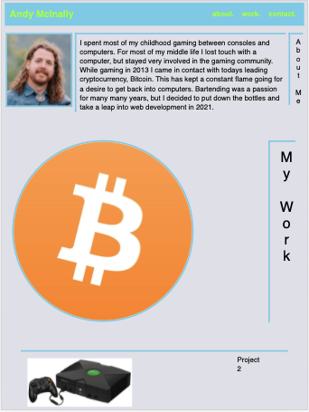
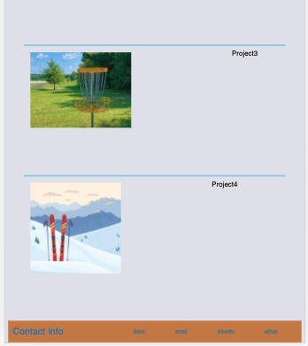

# 02 Advanced CSS: Portfolio

## Description

This is my unfinished personal portfolio. While it is not great, it has amazing potential. I know with the skills I will develope going forward in my path, this could be a templete portfolio of a major tech company. I worked long hours trying to design a next to perfect layout for viewer satisfaction. My motivation came from the site https://www.orestisgeorgiou.com/. And even though I did not achieve such a high bar, the good Dr. Orestis Georgiou has shown me the light. I built this project to get my million dollar smile out to the public. With time and dedication this project, along with hard work, will land me my dream job. I have learned to build my first website and it was dedicated to a model citizen.

Here is an idea of the process I took.

- Built out a skeleton with proper sematic tags
- Built out a footer with a nav bar.
- Built an About me section.
- Built a my Work section.
- Built a footer with contact info.
- Filled in comments to my work.
- Linked nav bar to sections.
- Linked my Work images to website/projects.
- Added accesibilty tags.
- Fiddled with wrapping flows for adjusting views.

Deplyed site:

https://shman-dee.github.io/personal-portfolio/
# updated-portfolio
